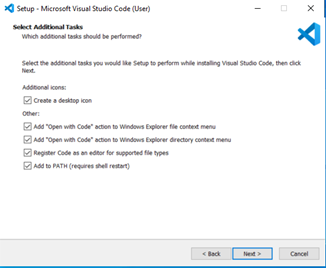
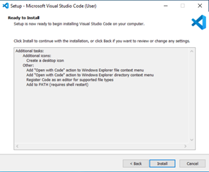

# General Guide to setting up Visual Studio Code and GitHub:
1.	Install VS Code
2.	Install Git
3.	Sign up for a GitHub Account
4.	Create SSH Keys
5.	Import SSH Key into GitHub
6.	Clone a GitHub Repository
7.	Push Changes to GitHub from VS Code. 

## Install Visual Studio Code
1.	Go to [Download Visual Studio Code](https://code.visualstudio.com/download)
2.  Click on the download for Windows
3.	Double click on the installer in your Downloads folder
4.	Follow the installer prompts as follows:
5.	Click Accept, then Next. 

6.	Check all the boxes then hit Next

 
7.	Click Install then finished, when the installation is complete

Install Git
1.	Go to [Download git got Windows](https://git-scm.com/download/win) and click on the 64-bit for Windows Setup
2.	Double click on the installer in your Downloads folder
3.	Follow the installer prompts as follows:
4.	You will be prompted to add in your credentials for installation
    - Click on more choices
    - Select your PIV
    - Type in you pin
5.	On the information page click Next
 
6.	Keep all default checkboxes and click Next
 
7.	In the dropdown, select Visual Studio Code as Git’s default editor
 
8.	Choose Let git decide and click Next
 

9.	Us the recommended Git from the command line and from 3rd-party software
 

10.	Click Use bundled OpenSSH
 

11.	Click use the OpenSSL library
 

12.	Click Checkout Windows-styl, commit Unix-style line endings
 

13.	Click Use MinTTY
 

14.	Click Default
 

15.	Click Git Credential Manager

 

16.	Click Enable file system caching

 

17.	Click install

 

## Sign up for a GitHub Account
1.	Go to GitHub.com and create an account with you DOT email (Make sure it’s a private account!)

## Create SSH Keys
1.	Open Windows PowerShell
2.	Make sure you are in your User directory C:\Users\your_user_name directory by typing the command cd  C:\Users\your_user_name
3.	Type in the following command ssh-keygen -o -t rsa -C “your email address”
 

4.	You can choose to have a password or just hit enter for no password
 - Note: when you have a password you will need to enter it in again whenever you try to import the key, so do not lose your password or you will need to create new keys
5.	In your C:\Users\you_user_name\.ssh you should have id_rsa and id_rsa.pub key files

## Import SSH Key into GitHub
1.	Click on you user icon in the top right corner
2.	Click Settings
3.	Click on SSH and GPG Keys
4.	Click on New SSH Key in the upper right side
5.	In you file explorer, go to C:\Users\you_user_name\.ssh and open the id_rsa.pub in notepad
6.	Copy the entire key
7.	Go back to your GitHub Add new SSH Key page
8.	Paste the Key in the box labeled Key
 
9.	Give it a title (anything you want)
10.	Click Add SSH Key (this is where you may be prompted for the password you used to create the SSH keys.

## Clone a GitHub Repository
### Important Notes:
-	you will need an already created repository with at least one file in it to continue
-	You need to have Git downloaded on your machine for this to work
-	You need save cloned repositories within the C:\Users\you_user_name folder (it can be within a folder in that folder)
1.	Click on the repository you want to clone
2.	Click on the Code dropdown on the right side
3.	Make sure the SSH header is selected
4.	Copy the SSH link
 
5.	Go to Visual Studio Code
6.	Hit ctrl+shift+p and search for Git:Clone
7.	Select Clone from GitHub
8.	Paste the SSH link
9.	You will be prompted to save the clone somewhere on your computer
10.	You can save it in a New or existing folder, but that folder MUST be in your C:\Users\you_user_name folder
11.	Click save
12.	You can open the repo folder in Visual Studio Code right away or navigate to it by opening it through the File dropdown in Visual Studio Code later. 
 
## Push Changes to GitHub from VS Code
1.	Open your cloned repo (File>Open Folder>navigate to the folder of your repo and click open)
2.	As a test, make a small change to one of the files in your repo
    - For example, I am going to make a comment “This is a push test” in one of my python documents
3.	Save the file you made a change to. 

 

4.	The file turned yellow and there is notification in you source control. Click on the source control notification
5.	If you scroll over the changes, there should be a + sign you can click to stage the changes
6.	After you stage the changes, you can click on the blue Commit button above it.
7.	You can choose to commit straight to your main branch or another branch under main
    - Note: unless you are working with a bunch of people on one project, it’s likely you’ll just commit to main

 

8.	A COMMIT_EDITMSG will appear in a new window. Put a short comment like “testing a push change to GitHub”
 
9.	Click the check mark all the way in the upper right on the VS Code window
10.	A prompt will as you to save, click Save
11.	The final step is the hit the Sync Changes button that replaced the Commit button
    - Note: this will sync up your workstation and GitHub
 

12.	After the sync is compete, navigate to your repo on GitHub. You should see the change you made and the code on GitHub and the cloned repo should match. 

    - Note: There are tons of things you can do with GitHub and VS Code integration. This guide should help you get started. 
